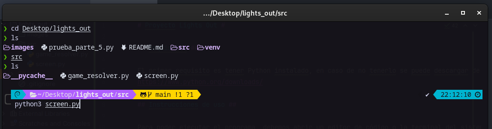

# Proyecto Lights Out #

## Requisitos ##

El primer requisito es tener Python instalado, en caso de no tenerlo se puede descargar de su página oficial:
https://www.python.org/downloads/

## Instrucciones de uso ##

Para poder ejecutar el programa, debemos abrir un editor de código o la terminal del sistema operativo en la carpeta
**src** que se encuentra dentro de nuestro proyecto.
Se debe ejecutar el archivo **screen.py**

En caso de hacerlo por la terminal del sistema operativo podemos ejecutar el siguiente comando:

En Windows:
~~~
python screen.py
~~~

En Linux:
~~~
python3 screenpy
~~~

Como segundo requisito, se debe tener la biblioteca de **numpy** instalada para poder ejecutar el programa.
En caso de que no se tenga instalada se puede ejecutar el siguiente comando tanto en Windows como en Linux:
~~~
pip install numpy
~~~

Igualmente, ante cualquier problema, se pueden comunicar con cualquiera de nosotros para recibir soporte.